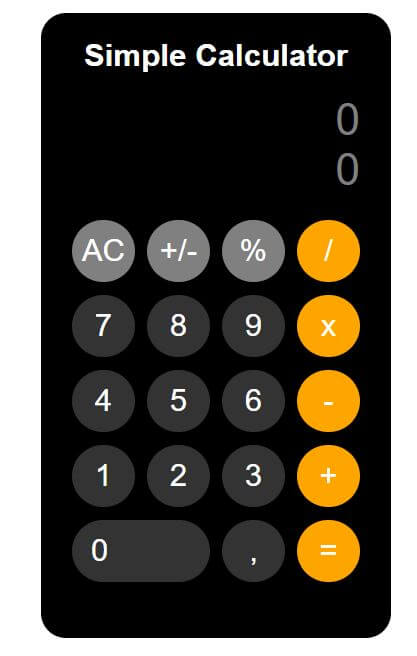

# Calculator
<table>
<tr>
<td>
  A basic calculator built using React.Js library. The calculator performs basic math functions and enables to multiply, divide, add and substact.
</td>
</tr>
</table>

# 

## Built with 

- [Create React App](https://github.com/facebook/create-react-app) - simplified tool when building React apps.

## To-do
- Add keylisteners in order to make inputs using a keyboard.